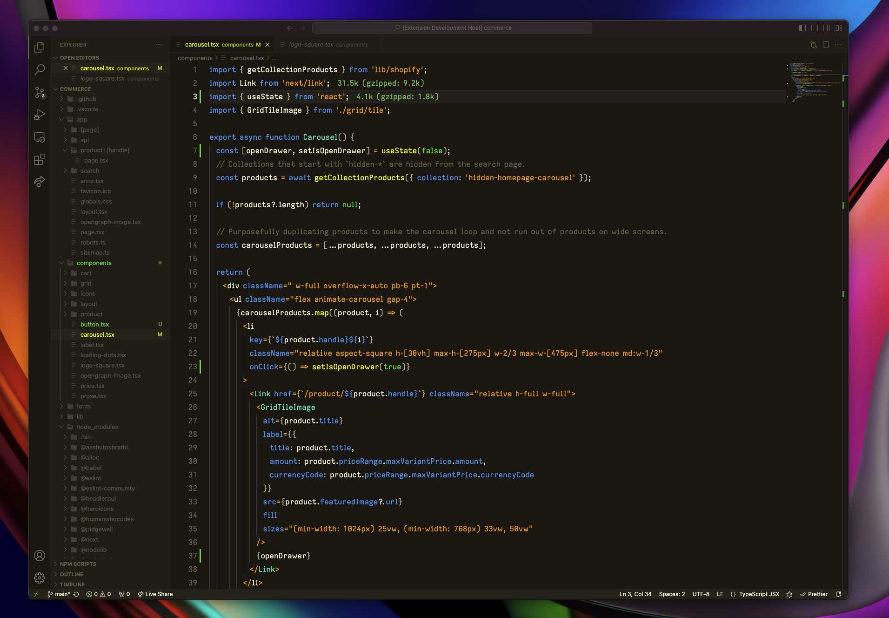

# Summercamp - A theme for VS Code

Summercamp is a dark theme inspired by the default colour scheme of the [Zed Editor](https://zed.dev/).



To streamline a few more elements and bring it closer to the Zed editor experience please add these values, `settings.json`:

```json
{
  // ... Settings object (trimmed),
  "editor.bracketPairColorization.enabled": false, // Brackets are all the same color.
  "editor.guides.indentation": false // Disable indentation lines.
}
```
